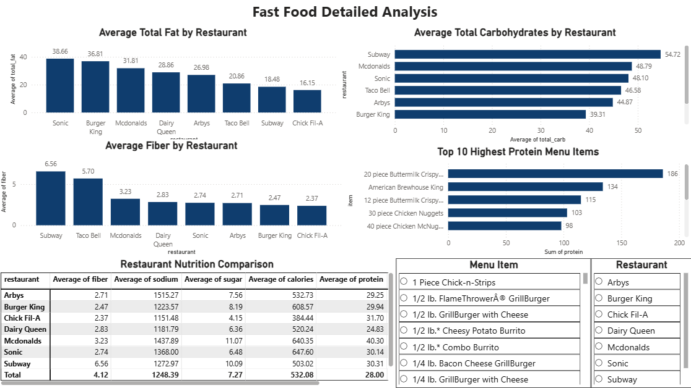

# Fast Food Analysis Dashboard 🍔📊

## Project Overview
An interactive 2-page Fast Food Analysis Dashboard built using Power BI to analyze and compare
the nutritional composition of 510 menu items across 8 major fast-food restaurant chains.

## Tools Used
- Power BI (Dashboard & Visualizations)
- SQL (Data Source)
- Microsoft Excel (Dataset)

## Dataset
- Total Menu Items: 510
- Total Restaurants: 8 (Sonic, McDonalds, Burger King, Arbys, Dairy Queen, Subway, Taco Bell, Chick Fil-A)
- Key Columns: Restaurant, Item, Calories, Total Fat, Saturated Fat, Cholesterol, Sodium,
  Total Carbohydrates, Fiber, Sugar, Protein, Vitamin A, Vitamin C, Calcium

## Data Cleaning
- Removed unnecessary columns (Satish, age, salad)
- Removed 3 duplicate records
- Handled missing values in Fiber column (replaced with median value 3)
- Handled missing values in Protein column (replaced with median value 25)
- Verified all nutritional columns were in correct numeric format

## Dashboard Pages

### Page 1 — Fast Food Analysis Dashboard
- KPI Cards: Total Restaurants (8), Total Menu Items (510), Avg Calories (532.08),
  Avg Protein (28g), Avg Sugar (7.27g), Avg Sodium (1.25K mg)
- Bar Chart: Average Calories by Restaurant
- Bar Chart: Average Sodium by Restaurant
- Bar Chart: Average Protein by Restaurant
- Bar Chart: Average Sugar by Restaurant
- Bar Chart: Top 10 Highest Calorie Menu Items
- Bar Chart: Top 10 Lowest Calorie Menu Items

### Page 2 — Fast Food Detailed Analysis
- Bar Chart: Average Total Fat by Restaurant
- Bar Chart: Average Total Carbohydrates by Restaurant
- Bar Chart: Average Fiber by Restaurant
- Bar Chart: Top 10 Highest Protein Menu Items
- Table: Restaurant Nutrition Comparison
- Interactive Slicers: Filter by Menu Item and Restaurant

## Key Insights
- Sonic has the highest average calories (647.60) among all restaurants
- Chick Fil-A has the lowest average calories (384.44)
- McDonalds leads in average protein (40g per item)
- Subway has the highest average carbohydrates (54.72g) and fiber (6.56g)
- Arbys has the highest average sodium (1515.27 mg)
- 20 Piece Buttermilk Crispy Chicken is the highest calorie item (2.4K calories)
- Side Salad is the lowest calorie item across all restaurants

## Dashboard Preview

### Page 1 — Fast Food Analysis Dashboard

### Page 2 — Fast Food Detailed Analysis

## Presented By
**N Lokesh** — B.Tech AI & Data Science | Data Analyst
